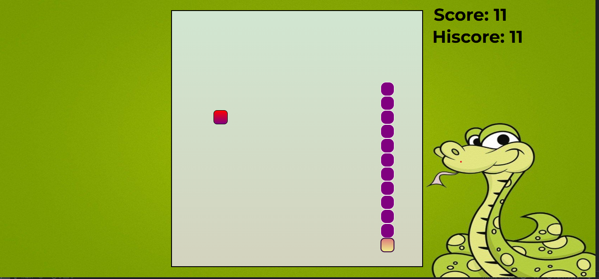

# SnakeGame 🐍🎮

A simple Snake Game built using HTML, CSS, and JavaScript.

## 📌 Features

- Snake movement using arrow keys
- Score and high score tracking (localStorage)
- Sound effects (move, eat, game over)
- Responsive grid with CSS Grid

## 🚀 How to Play

- Use ↑ ↓ ← → to move the snake
- Eat the food to grow
- Don't hit the wall or yourself!

## 📂 Project Structure
<pre>
SnakeGameH/
├── index.html
├── style.css
├── script.js
├── music/
│ ├── food.mp3
│ ├── gameover.mp3
│ ├── move.mp3
│ └── music.mp3
└── README.md</pre>

## 📸 Screenshot

## 🧑‍💻 Author

Created by **Harish Kaushik**  
GitHub: [@harishkaushik234](https://github.com/harishkaushik234)
 